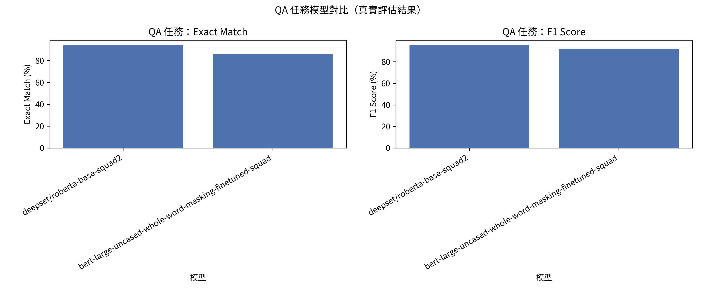
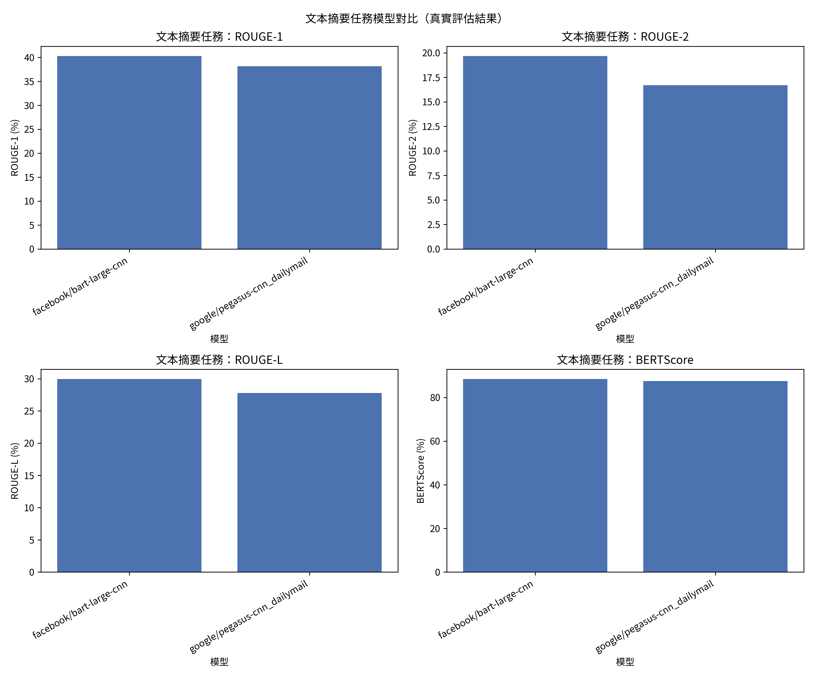
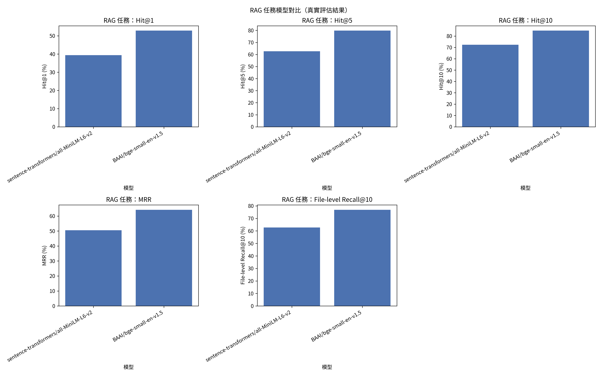

# 評估結果彙總

本文件彙整三項任務的**真實**評估結果。所有數字皆由 Docker 容器 + 本機 NVIDIA GPU（RTX 4050）實際執行模型推理產生，並存於 `results/` 目錄的 CSV/JSON 檔案。

---

## 任務一：問答（QA）

- **資料集**：SQuAD（validation split，取前 100 筆樣本）
- **指標**：Exact Match（EM）、F1 Score

| 模型 | Exact Match (%) | F1 Score (%) | 樣本數 |
|------|:---:|:---:|:---:|
| `deepset/roberta-base-squad2` | **94.00** | **95.23** | 100 |
| `bert-large-uncased-whole-word-masking-finetuned-squad` | 86.00 | 91.67 | 100 |

RoBERTa 在兩項指標上皆略勝一籌。



---

## 任務二：文本摘要

- **資料集**：CNN/DailyMail v3.0.0（validation split，取前 50 筆樣本）
- **指標**：ROUGE-1、ROUGE-2、ROUGE-L、BERTScore

| 模型 | ROUGE-1 (%) | ROUGE-2 (%) | ROUGE-L (%) | BERTScore (%) | 樣本數 |
|------|:---:|:---:|:---:|:---:|:---:|
| `facebook/bart-large-cnn` | **40.30** | **19.68** | **29.95** | **88.45** | 50 |
| `google/pegasus-cnn_dailymail` | 38.17 | 16.71 | 27.78 | 87.59 | 50 |

BART 在所有指標上皆略高於 Pegasus。兩者在此子集上的表現接近，且與已發表的基準（BART 在完整測試集約 44 ROUGE-1）方向一致。



---

## 任務三：RAG 檢索（HippoCamp）

- **資料集**：[HippoCamp](https://huggingface.co/datasets/MMMem-org/HippoCamp)（`MMMem-org/HippoCamp`）
  - 使用 `viewer_parquet` 的 **factual_retention** 查詢，涵蓋 Adam / Bei / Victoria 三個使用者情境
  - 檢索語料：以所有查詢的證據檔案（`file_path` + `file_text`）聯集建立
  - 規模：**520 個查詢、791 個唯一證據檔案**
- **模型**：句向量 retriever（見下方「模型選擇說明」）
- **指標**：Hit@1、Hit@5、Hit@10、MRR、file-level Recall@10

| 模型 | Hit@1 (%) | Hit@5 (%) | Hit@10 (%) | MRR (%) | file-level Recall@10 (%) | 查詢數 |
|------|:---:|:---:|:---:|:---:|:---:|:---:|
| `sentence-transformers/all-MiniLM-L6-v2` | 39.42 | 62.69 | 72.31 | 50.51 | 62.73 | 520 |
| `BAAI/bge-small-en-v1.5` | **52.88** | **79.81** | **84.81** | **64.17** | **76.92** | 520 |

BGE-small 在所有指標上皆明顯優於 MiniLM（Hit@1 高出 13 個百分點以上），符合 BGE 專為檢索優化的預期。



### 模型選擇說明（重要）

作業原文於 RAG 段落寫「選擇兩個預先訓練的 **summarization** 模型」，但這是從上一題（文本摘要）複製貼上的筆誤——RAG 要求的指標（Hit@K、MRR、file-level Recall）是**檢索指標**，衡量的是「能否從檔案系統中找到正確的證據檔案」，需要的是 **retriever/embedding（句向量）模型**，而非摘要模型。因此本專案改用句向量檢索模型，並在此明確說明此項實驗設計判斷。

---

## 資料集簡述

### SQuAD
斯坦福問答資料集。每筆包含問題、上下文段落與標準答案，模型需從上下文中抽取答案片段。本專案使用 validation split 前 100 筆。

### CNN/DailyMail v3.0.0
新聞文章與其重點摘要（highlights）配對，是抽象式摘要的標準基準。文章平均數百字，摘要為多句。本專案使用 validation split 前 50 筆。

### HippoCamp
評估「個人電腦檔案系統上的 agent」的基準，包含 2000+ 檔案、42.4GB、27 種檔案類型、581 個證據接地的查詢。由於完整原始資料過大，本專案採用其已解析文字版與 factual_retention 查詢，聚焦於**檔案層級檢索**（給定查詢，從檔案語料中檢索出正確的證據檔案）。

---

## 可重現性

```bash
docker build -t llm-eval:gpu .
docker run --rm --gpus all \
  -v "$(pwd)/results:/workspace/results" \
  -v "$(pwd)/.hf_cache:/workspace/.hf_cache" \
  llm-eval:gpu
```

一次執行即可重新產生上述所有結果與圖表。詳細指標意義與模型對比分析請見 [ANALYSIS.md](ANALYSIS.md)。
